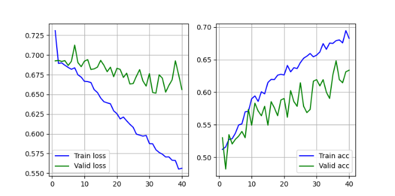
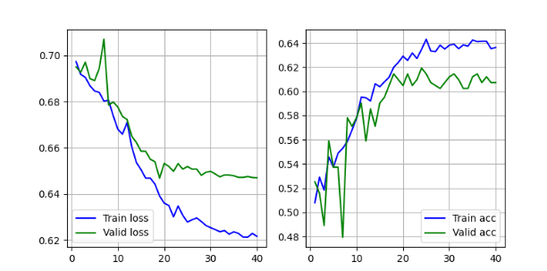
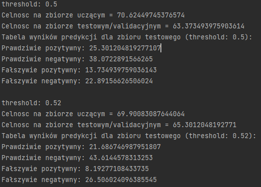

# AI Currency Rates Prediction with LSTM

# Cel projektu:
> celem jest przewidywanie zmiany kursu pary walutowej na kilka dni w przód, na podstawie kursów (nie tylko rozpatrywanej
> pary) z ustalonej liczby dni poprzedzających.

# Przyjęte założenia:
> W trakcie rozwiązywania problemu ustalono na ile dni do przodu będzie rozważana zmiana kursu, optymalna wartość to 5. Wartość ta 
> nie oznacza dokładnie liczby dni, a na ile wektorów obserwacji będziemy sięgać w przód, co w praktyce oznacza 7 dni do
> przodu, ponieważ giełda forex jest otwarta od poniedziałku do piątku (nie ma wektorów odpowiadających za sobotę i niedzielę).
> Natomiast liczbę wektorów na podstawie której dokonywana jest predykcja ustalona na 30.
> Dla mniejszych wartości wyniki predykcji mogły konkurować jedynie z rzutem monetą, a dla wartości większych nie zauważono 
> poprawy celności przewidywań, jedynie czas uczenia znacznie się wydłużał. Oczywiście wpływ ma model sieci,
> dla bardziej lub mniej złożonego modelu właściwsze mogą okazać się inne przedziały czasu.

# Wykorzystane technologie 
> - Pandas
> - Numpy
> - Pyplot
> - Tensorflow
> - Keras

# Dane Treningowe i Testowe
> Dane opierają się na globalnej giełdzie forex, gdzie notowania startują od 23:00 w niedzieli i trwają do godziny 22:00 w piątek)
> Pobrane pliki csv pochodzą ze strony .
> Dane wykorzystane w projekcie pochodzą z okresu: 2007-05-14 - 2023-05-19 i ostatecznie obejmują 3 pary walutowe:
> 1. EUR-USD
> 2. EUR-CHF
> 3. EUR-GBP
> 
> W zadaniu zwróciłem uwagę na 2 istotne elementy przygotowania danych dla sieci neuronowej:
>  1. Giełda otwiera się o 23:00 w niedzielę, co oznacza że mamy dane z jednej godziny oznaczone jako dane z całego dnia.
> Zatem przepisuje te dane w odpowiedni sposób do poniedziałku, nie tracą przy tym informacji, jak i usuwając z tabeli zbędny dzień tygodnia
> ```
>     for i, row in df.iterrows():
>        if row['WeekDay'] == 6:
>            if i + 1 >= df.shape[0]:
>                print('out of range!')
>                continue
>            df.loc[i + 1, "Open"] = row['Open']
>            df.loc[i + 1, "High"] = max(row['High'], df.loc[i + 1, "High"])
>            df.loc[i + 1, "Low"] = min(row['Low'], df.loc[i + 1, "Low"])
>            df.loc[i + 1, "Volume"] = sum([row['Volume'], df.loc[i + 1, "Volume"]])
>    df = df[df.WeekDay != 6]
> ```
>  2. W całym zbiorze znalazły się również dwa piątki w które giełda nie była otwartą (2015-12-31 i 2020-12-31 ). żeby zachować spójność
> i jednocześnie nie pozostawić tych dni z wartościami pustymi, uzupełniłem brakujące dane bardzo naiwnie kopiując wartości z dnia poprzedzającego.
> ```
>     for i, row in df.iterrows():
>        if row.WeekDay == 3:
>           if df.loc[i + 1, 'WeekDay'] != 4:
>                print(row.Time)
>                row.WeekDay = 4
>                row.Time += timedelta(days=1)
>                df = pd.concat([df, pd.DataFrame([row])])
> ```

# Działanie i Obsługa 
> Aplikacja jest podzielona na funkcję odpowiadające kolejnym krokom, jak pobranie danych, przygotowanie, utworzenie modelu,
> wyświetlenie wyników itd. Wybierając odpowiednie opcje możemy zapisywać utworzone zbiory danych jak i model sieci wraz z wagami,
> wybierając odpowiednie opcje posługując się terminalem, albo podstawiając przygotowany zastaw predefiniowanych opcji,
> możemy: korzystać z poprzednio utworzonego zbioru danych, albo zładować zapisaną sieć neuronową z wagami i przetestować 
> ją na nowych danych, bez powtórnego uczenia. Aplikacja nie posiada GUI, a jej możliwości sprowadzają się do manipulacji 
> kodem wybranych funkcji i wykresów biblioteki pyplot


# Rozwiązanie problemu i wynik 
> Do analizy przedziału czasu opisanego w sekcji Dane, najlepiej sprawdziła się sieć o następującej architekturze:
> ```
>   model = Sequential()
>   model.add(LSTM(64, return_sequences=True, activation='relu', input_shape=shape, kernel_initializer='glorot_uniform'))
>   model.add(Dropout(0.1))
>   model.add(LSTM(32, return_sequences=True, activation='relu', kernel_initializer='glorot_uniform'))
>   model.add(Flatten())
>   model.add(Dropout(0.1))
>   model.add(Dense(64, activation='relu'))
>   model.add(Dense(1, activation='sigmoid'))
>   optimizer = optimizers.Adam()
>   lr_scheduler = LearningRateScheduler(scheduleLearningRate)
>   model.build(input_shape=(None,) + shape)
>   model.compile(loss='binary_crossentropy', optimizer=optimizer, metrics=['accuracy'])
> ```
> Opcje trenowania:
> ```
> BATCH_SIZE = 32
> EPOCHS = 40
> lrScheduler = LearningRateScheduler(scheduleLearningRate)
>  model.fit(trainData[0], trainData[1], batch_size=BATCH_SIZE, epochs=EPOCHS, validation_data=valid,
>            callbacks=[lrScheduler])
> ```
> Parametr callbacks wywołuje funkcję która modyfikuje parametr szybkości uczenia, zmniejszając go co kilka epok, 
> pozwala to na lepsze dopasowanie sieci neuronowej i łatwiejsze szukanie minimum funkcji straty, zwłaszcza dla treningów 
> na małych zbiorach uczących z dużą liczba epok (iteracji)
> 
> Zbiór uczący składa się z pierwszych 90% dostępnych przypadków, a zbiór testowy z pozostałych następujących po sobie 10% przypadków,
> ogólnie wszystkich przypadków jest ponad 4 tysiące (dokładna liczba zależy od obranych przedziałow czasowych)
> 
> Na dokładną wartość celności predykcji ma wpływ wiele czynników jak np. wagi początkowe, daltego sieć była sprawdzana i 
> uczona kilku krotnie uzyskując wynik w okolicy 60% wzwyż:
> 
> 
> 
> 
> Na koniec należy rozważyć różne przypadki możliwej klasyfikacji:
> 1. Prawdziwie pozytywny
> 2. Prawdziwie negatywny
> 3. Fałszywie pozytywny
> 4. Fałszywie negatywny
> 
> Z perspektywy gracza giełdowego interesują nas przypadki pozytywne (bo w tedy chcemy inwestować), więc chcemy aby stosunek pozytywnie
> fałszywych i prawdziwych był jak najkorzystniejszy, można starać się poprawić ten wynik już po wytrenowaniu sieci,
> stosując threshold, który rozgranicza klasyfikację miedzy wzrost, a spadek cen waluty, nieznacznie zwiększając jego wartość
> możemy znacznie zmniejszyć liczbę przypadków Fałszywie pozytywnych, a w niewielkim stopniu zmniejszyć liczbę Prawdziwie pozytywnych,
> co zmienia stosunek tych dwóch wartości na naszą korzyść, nie da się dokładnie zdefiniować wartości threshold, należy 
> w sposób iteracyjny znaleźć wartość najbardziej nas satysfakcjonującą:
> 
> 
> 
